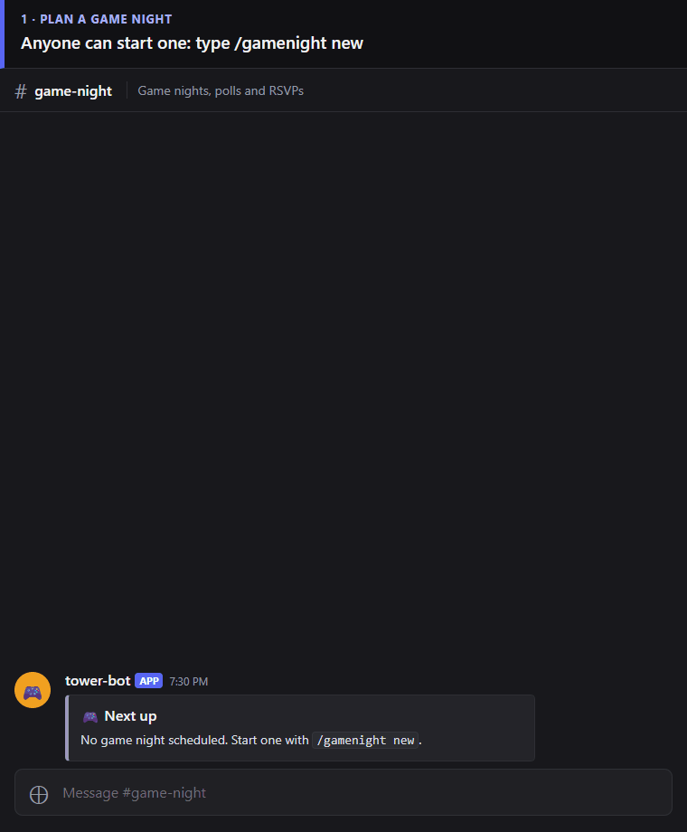
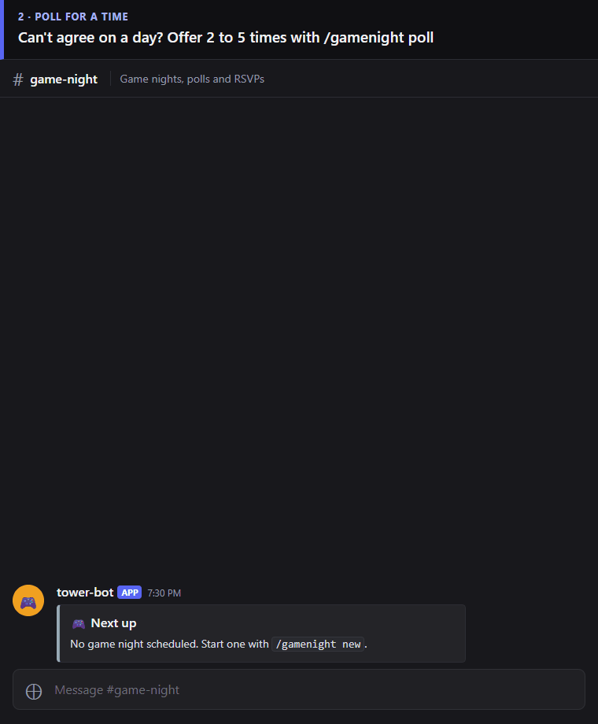
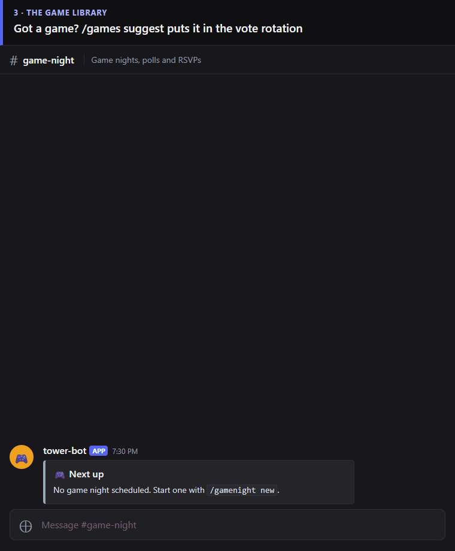
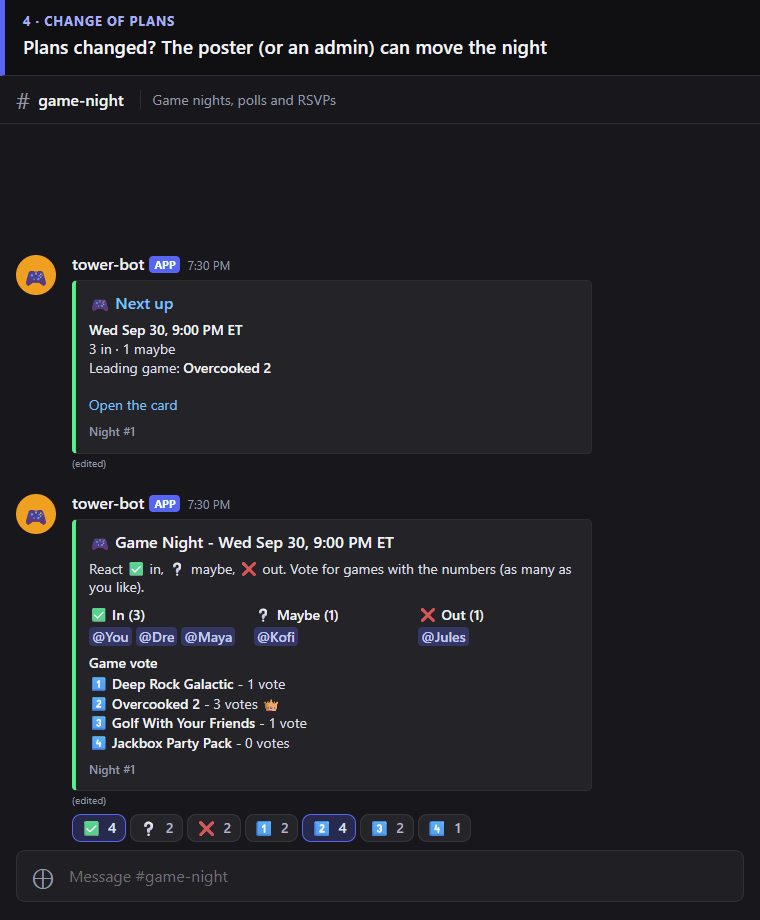
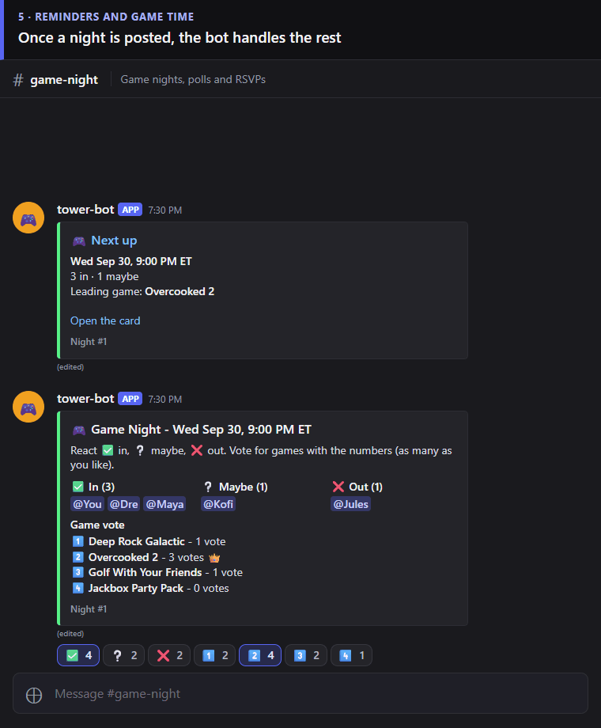

# tower-bot

A Discord bot for Tower, the home Unraid server. It starts with a game night feature for a private Discord server, with room to grow into small ops notifications later. See the design spec in [GuessLee/unraid](https://github.com/GuessLee/unraid/blob/main/docs/superpowers/specs/2026-09-28-tower-bot-game-night-design.md) for the full plan.

## How to use it

Everything is a slash command: type `/` in any channel and pick the command from the list. Replies to your commands are private ("Only you can see this"), the cards land in `#game-night`.

### 1. Plan a game night

`/gamenight new` posts a card for next Wednesday 9 PM ET (or pass `when:` like `fri 8pm`, `10/14 9pm`, `tomorrow 9:30pm`). React ✅ in, ❔ maybe, ❌ out, and vote for games with the numbers.



### 2. Poll for a time

`/gamenight poll times:wed 9pm, thu 9pm, sat 8pm` lets everyone react with the times that work. Whoever posted it locks one with `/gamenight pick option:3`.



### 3. The game library

`/games suggest name:...` adds a game to the vote rotation, `/games list` shows them all, and the pinned list in `#game-library` updates itself. Admins can `/games remove`.



### 4. Change of plans

The poster or an admin can `/gamenight move when:sat 8pm`, pick the game with `/gamenight game number:1`, or call it off with `/gamenight cancel`.



### 5. Reminders and game time

Nothing to type: the bot pings everyone who is in or maybe 24 hours and 1 hour before, then locks the winning game at start time.



Something broken or missing? `/feedback text:...` files it for the admin.

## Dev

```bash
docker run -d --name tb-pg -p 5432:5432 -e POSTGRES_PASSWORD=postgres postgres:16
pip install -e ".[dev]"
pytest
```

Config lives only in `bot.env` plus secrets kept on Tower. Never commit tokens, connection strings, or other secrets to this repo.

### Regenerating the GIFs

The GIFs are not screen recordings. `scripts/demo/make_demo.py` runs the real commands against a scratch database and a fake Discord, then draws the resulting channel in a Discord-style page, so the cards and replies are exactly what the bot sends and the people in them are made up. Re-run it after changing a card or a reply:

```bash
pip install -e ".[dev,demo]" && playwright install chromium
python -m scripts.demo.make_demo
```
